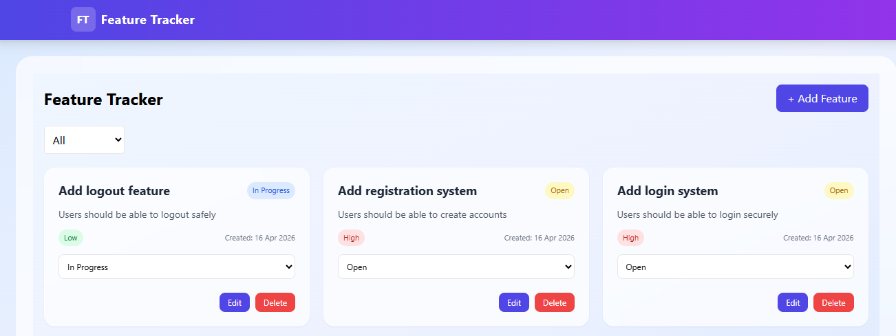
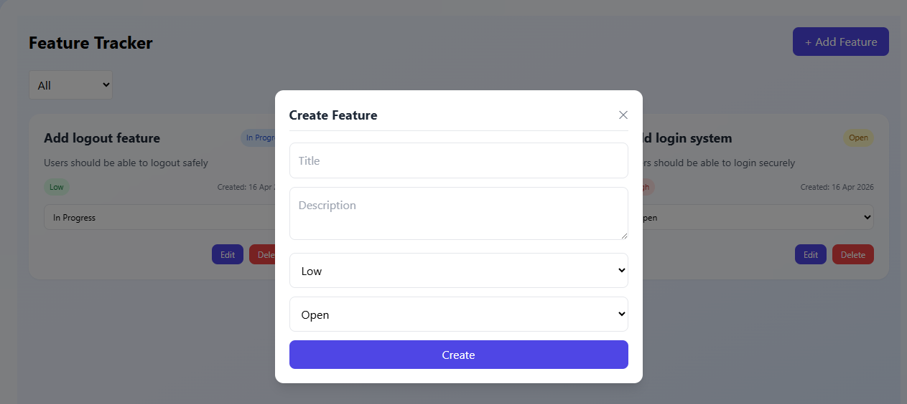
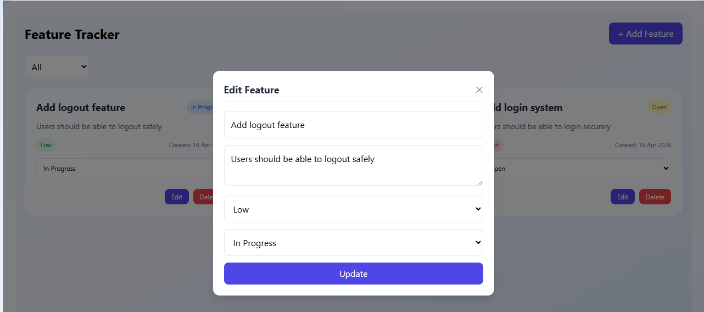
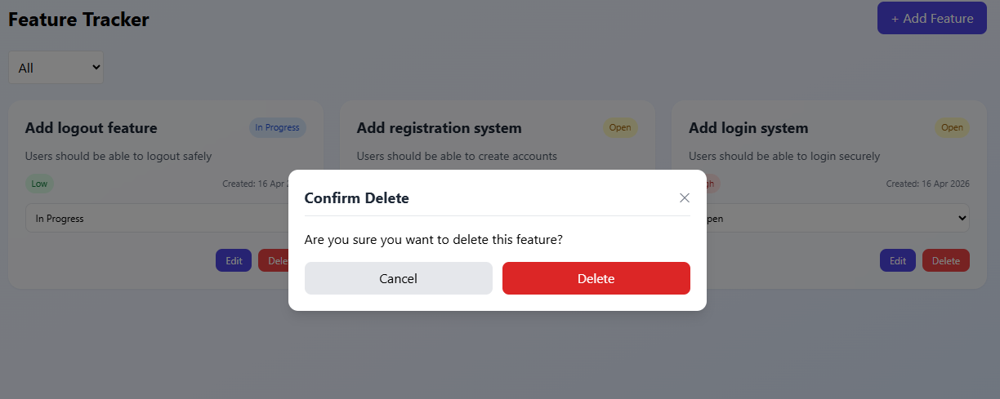

# Feature Tracker System

A full-stack feature request management application for creating, updating, filtering, and tracking product ideas through a clean web interface.

## Overview

This project combines a React frontend, an Express API, and a MySQL database to provide a simple workflow for managing feature requests. Users can create new requests, edit existing ones, update status, filter the list, and remove items when they are no longer needed.

## Highlights

- Full CRUD workflow for feature requests
- Status management with `Open`, `In Progress`, and `Completed`
- Priority tracking with `Low`, `Medium`, and `High`
- Status-based filtering from the dashboard
- Inline feedback for success and error states
- Modal-based create, edit, and delete flows
- MySQL-backed persistence with a ready-to-run SQL schema

## Tech Stack

- Frontend: React 19, Vite, Tailwind CSS, Axios
- Backend: Node.js, Express, CORS, dotenv
- Database: MySQL

## Project Structure

```text
feature-tracker-system/
|-- feature-tracker-backend/
|   |-- config/
|   |-- controllers/
|   |-- models/
|   |-- routes/
|   `-- server.js
|-- feature-tracker-frontend/
|   |-- src/
|   |   |-- api/
|   |   |-- components/
|   |   `-- pages/
|   `-- package.json
|-- screenshots/
|-- database.sql
`-- README.md
```

## Features

### Frontend

- Dashboard view for all feature requests
- Add feature modal
- Edit feature modal
- Delete confirmation modal
- Status filter dropdown
- Notification messages for API actions

### Backend

- REST API for managing feature requests
- Input validation for IDs, title, description, priority, and status
- Dedicated endpoint for updating only feature status
- Server-side filtering by status and optional date query

## API Endpoints

Base URL: `http://localhost:5000/api/features`

| Method | Endpoint | Description |
| --- | --- | --- |
| `GET` | `/` | Fetch all features |
| `GET` | `/:id` | Fetch a single feature |
| `POST` | `/` | Create a feature |
| `PUT` | `/:id` | Update a feature |
| `DELETE` | `/:id` | Delete a feature |
| `PATCH` | `/:id/status` | Update only the status |

## Database

The SQL schema is included in [database.sql](./database.sql). It creates:

- The `feature_tracker` database
- The `feature_requests` table
- Sample seed data for local testing

Core fields:

- `title`
- `description`
- `priority`
- `status`
- `created_at`
- `updated_at`

## Getting Started

### 1. Clone the repository

```bash
git clone https://github.com/athumaniMfaume/feature-tracker-system.git
cd feature-tracker-system
```

### 2. Set up the database

Create the database and table by running the SQL in `database.sql`.

```sql
SOURCE database.sql;
```

If you prefer to run it manually, the database name used by the app is:

```env
feature_tracker
```

### 3. Configure the backend

Move into the backend folder and install dependencies:

```bash
cd feature-tracker-backend
npm install
```

Create a `.env` file inside `feature-tracker-backend/`:

```env
PORT=5000
DB_HOST=localhost
DB_USER=root
DB_PASSWORD=
DB_NAME=feature_tracker
```

Start the backend:

```bash
npm run dev
```

### 4. Configure the frontend

Open a second terminal:

```bash
cd feature-tracker-frontend
npm install
npm run dev
```

The frontend calls the backend at:

```text
http://localhost:5000/api/features
```

## Screenshots

### Dashboard



### Add Feature



### Edit Feature



### Feature List View



## Professional Notes

- The backend is organized into `routes`, `controllers`, `models`, and `config` for separation of concerns.
- Validation is handled on the API layer before database writes.
- The UI uses a simple modal-driven workflow that keeps common actions close to the dashboard.
- The schema includes sample records, which makes local setup faster for reviewers and recruiters.

## Future Improvements

- Authentication and role-based access
- Search and advanced filtering
- Pagination for larger datasets
- Environment-based API configuration for production deployment
- Automated tests for API and UI flows

## Author

**Athumani Mfaume**

- GitHub: [athumaniMfaume](https://github.com/athumaniMfaume)
- Location: Dar es Salaam, Tanzania

## License

This project is intended for assessment, portfolio, and educational use.
